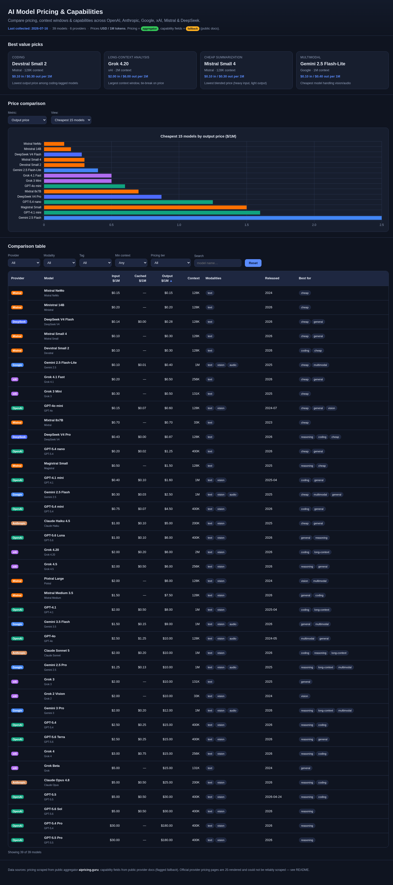

# AI Model Pricing & Capabilities Dashboard

An interactive, **fully local** dashboard comparing the latest AI model pricing
and capabilities across six major providers: **OpenAI, Anthropic, Google Gemini,
xAI, Mistral, and DeepSeek**.



## What it shows

- **Sortable comparison table** — click any column header to sort (provider,
  model, input/cached/output price, context window, modalities, release date,
  tags). Click again to reverse.
- **Filters** — provider, modality, suitability tag, minimum context window,
  pricing tier (budget / mid / premium), and a name search.
- **Price-comparison charts** (Chart.js) — cheapest 15 models or per-provider
  averages, by input / output / blended price.
- **"Best value" picks** — recommended models for coding, long-context
  analysis, cheap summarization, and multimodal tasks.
- **Visible "last collected" timestamp** and per-field provenance badges.
- **Data-health banner** (under the header) — an at-a-glance tally read straight
  from `data/models.json`: how many models carry `official` / `aggregator` /
  `fallback` prices, how many context windows are `official`, how many rows are
  price-stale, and a **price-regression** count. The regression chip is green at
  0 and turns amber only when an `official_refresh.drift_vs_previous_run` entry
  exceeds the 25% threshold — i.e. a stable official price that shifted
  run-over-run, the real parser/layout-regression signal. Drift of an incoming
  official value vs the aggregator estimate it *replaced*
  (`official_refresh.drift`) is expected on most runs and is shown separately as
  a neutral, informational "official ≠ aggregator" chip only when present — it
  is never an alarm.

All prices are normalized to **USD per 1,000,000 tokens**.

## Run it locally

No build step, no dependencies to install. Just serve the folder statically:

```bash
cd apps/model-pricing-dashboard
python -m http.server 8000
```

Then open <http://localhost:8000> in a browser.

To regenerate the screenshot (or just sanity-check the rendered data-health
line) in one step — serves on an ephemeral port, renders in the browser skill,
writes `screenshot.png`, and shuts the server down cleanly:

```bash
python preview.py            # -> screenshot.png + prints #data-health
python preview.py --no-shot  # just print #data-health, no screenshot
```

(Chart.js loads from a CDN, so keep an internet connection for the charts. The
data itself is served from the local `data/models.json`.)

`preview.py` first runs `validate_dataset.py` and prints a one-line PASS/FAIL
summary, so a malformed dataset is caught before you look at the render.

## Validate the data

`validate_dataset.py` checks the assembled `data/models.json` against the
invariants the dashboard relies on — every model has a valid name/provider,
prices are `None` or `>= 0`, context windows are positive, provenance values are
one of `official` / `aggregator` / `fallback`, `price_stale` rows are priced
`fallback`, top-level counts/timestamp are consistent, and names are unique. It
also emits **warnings** (non-failing) for smells like two same-family models
sharing an identical price triple — the shape of the [#97] aggregator
mis-match. Complements the parser/matcher tests by pinning the *finished* data.

```bash
python validate_dataset.py          # human summary; exit 1 if any ERROR
python validate_dataset.py --json   # machine-readable report
python validate_dataset.py -f x.json
```

## Refresh the data

**Best fidelity — official pages via the browser skill (`scrape_official.py`)**

```bash
python scrape_pricing.py               # 1. aggregator baseline (all providers)
python scrape_official.py              # 2. overlay OFFICIAL prices where available
python scrape_official.py --dry-run    # scrape + report, don't write
python scrape_official.py --no-validate # skip the post-scrape integrity check
```

After writing, `scrape_official.py` runs a **non-blocking** `validate_dataset`
integrity check on the freshly-assembled data and prints a one-line
`validation PASS/FAIL · E errors · W warnings` summary (listing any errors /
warnings). So a malformed manual refresh is caught right at the scrape rather
than only at preview or in the weekly cron. A validator problem never masks an
otherwise-successful scrape; pass `--no-validate` to skip it.

`scrape_official.py` drives the persistent stealth browser to render each
provider's **own** pricing page, parses the live token-price tables from the
rendered DOM, and overlays them onto `data/models.json`. Confirmed values are
flagged provenance `official` (blue badge) and take precedence over the
aggregator. Matching is **strict** (exact normalized model name) so a model
variant is never mis-priced — a model not found on the official page keeps its
existing aggregator/fallback price untouched. As of the last run it confirmed
**18 models across 5 providers** (OpenAI 9, Google 4, Anthropic 2, DeepSeek 2,
xAI 1). See `official_refresh` in `data/models.json` for the per-provider tally.

**Price-drift sanity checks** — `scrape_official.py` runs two non-blocking
guards (neither stops the write; both just surface likely parser/layout
regressions), each flagging any move larger than **25%**:

1. *vs previous value* — before overwriting a price, the incoming official value
   is compared to whatever the model held moments earlier (the aggregator/
   fallback baseline). Recorded in `official_refresh.drift`.
2. *vs previous run* — the settled prices are compared **run-over-run** against
   the same model's like-tier value in the last snapshot, so an
   official→official regression across weeks is caught even when
   `scrape_pricing.py` did not run first. Recorded in
   `official_refresh.drift_vs_previous_run` (with `history_compared_to`).

Each run appends a compact snapshot (date + per-model input/cached/output +
provenance) to **`data/price_history.json`**, keeping the last **12** runs
(append-only, capped). Both drift counts are printed to stdout.

**Aggregator refresh** — scrape prices from the public aggregator and regenerate
`data/models.json` with a new `last_collected` timestamp:

```bash
python scrape_pricing.py               # scrape + write data/models.json
python scrape_pricing.py --dry-run     # scrape + report, don't write
python scrape_pricing.py --no-validate # skip the post-scrape integrity check
```

Like `scrape_official.py`, this runs the non-blocking `validate_dataset` check
after writing and prints the shared `validation PASS/FAIL · E errors · W
warnings` line — so **every** writer (both scrapers and `preview.py`) surfaces
the same integrity summary from one place (`validate_dataset.check_and_report`).

`scrape_pricing.py` fetches each provider's aggregator page via Tavily
`extract(extract_depth="advanced")`, parses the pricing tables (columns are
located by header name, since some pages omit the "Tier" column), and updates
the price fields on the catalog defined in `build_dataset.py`. Capability fields
(context / modalities / release / tags) stay hand-maintained and keep their
`fallback` provenance.

If a model can't be matched in the live table (name drift, row removed,
transient fetch error), its **last-known price is kept** and it is flagged
`price_stale: true` with pricing provenance downgraded to `fallback` — the
dashboard keeps showing the row rather than dropping it. A `refresh` block in
the JSON records how many models matched vs. were kept stale.

**Offline baseline** — regenerate from the hand-encoded values only (no network):

```bash
python build_dataset.py
```

**Automated weekly refresh** — a cron job (`weekly-pricing-refresh`, schedule
`0 9 * * 1` — Mondays 09:00 local) runs **both** scrapers in order —
`scrape_pricing.py` (aggregator baseline) then `scrape_official.py` (official
overlay) — then runs `validate_dataset.py --json` as a shipping gate. It posts a
short summary to Slack reporting the official matched count, the aggregator
matched/stale counts, the new `last_collected` date, both drift counts, and a
`validation PASS/FAIL · E errors · W warnings` segment — leading with the
failure (and listing the errors) when validation does not pass, and calling out
collision-smell warnings even when it does. So the snapshot stays current, and a
malformed refresh is surfaced rather than silently shipped. Manage it with
`python tools/cron.py list|show|update|disable weekly-pricing-refresh`.

## Data sources & provenance

Every model row carries a `provenance` map so you can see which fields are fresh
scrapes vs. reasonable fallbacks.

### Pricing — `official` (scraped from the provider's own page)

Token prices for 18 models were read directly from each provider's **own**
pricing page, rendered in the browser skill (`scrape_official.py`). These are the
highest-confidence values and carry a blue badge in the UI:

| Provider  | Official page |
|-----------|---------------|
| OpenAI    | `developers.openai.com/api/docs/pricing` |
| Anthropic | `docs.claude.com/en/docs/about-claude/pricing` |
| Google    | `ai.google.dev/gemini-api/docs/pricing` |
| xAI       | `docs.x.ai/developers/pricing` |
| DeepSeek  | `api-docs.deepseek.com/quick_start/pricing` |

### Pricing — `aggregator` (scraped)

Input / cached / output token prices were scraped from the public aggregator
**[aipricing.guru](https://www.aipricing.guru/)** (server-rendered HTML pricing
tables, "last synced" 2026-07-12…15), using Tavily `extract(extract_depth="advanced")`
and cross-checked against public web-search results. Pages used:

| Provider  | Source page |
|-----------|-------------|
| OpenAI    | `aipricing.guru/openai-pricing` |
| Anthropic | `aipricing.guru/anthropic-pricing` |
| Google    | `aipricing.guru/google-ai-pricing` |
| xAI       | `aipricing.guru/xai-pricing` |
| Mistral   | `aipricing.guru/mistral-pricing` |
| DeepSeek  | `aipricing.guru/deepseek-pricing` |

### Capabilities — `official` (from the provider's own page)

`scrape_official.py` also upgrades a model's **context window** to `official`
(strict exact-name match) when a provider states it on its own page. Context
lives in two places depending on the provider:

- **DeepSeek / xAI** — on the *pricing* page (parsed alongside prices).
- **OpenAI / Anthropic** — on the *models* page (`developers.openai.com/api/docs/models`,
  `docs.claude.com/en/docs/about-claude/models/overview`).
- **Google** — on the interactive models gallery
  (`ai.google.dev/gemini-api/docs/models`); the value only appears after
  clicking a model card, so it is read best-effort (a card that can't be
  matched is skipped, keeping the fallback).

As of the last run **11 context windows** are flagged `official`, correcting 6:

| Model | Was (fallback) | Now (official) |
|-------|----------------|----------------|
| GPT-5.6 Sol / Terra / Luna | 400K | **1.05M** |
| Claude Opus 4.8 | 200K | **1M** |
| Gemini 3.5 Flash / 3 Pro | 1M | **1,048,576** |
| DeepSeek V4 Flash / Pro | 128K | **1M** |
| Grok 4.5 | 256K | **500K** |

See `official_refresh.context_upgrades` / `context_pages` in `data/models.json`.
Modalities are **not** upgraded — the pages list per-token modality columns only
for a few realtime/image models, not the main text models, so mapping them per
catalog row was not reliable; they stay `fallback`.

### Capabilities — `fallback` (public docs)

The remaining capability fields — context window (where the official page does
not state it), modalities, release date and suitability tags — are **not** listed
in the aggregator price tables, so they were filled from **public provider docs
and model cards** as reasonable fallback values. These are flagged `fallback` in
the dataset and with an amber badge in the UI.

### Sources that could NOT be reliably scraped

The official provider pricing pages are JavaScript-rendered single-page apps, so
plain-HTTP `Tavily extract()` returns marketing/nav copy rather than the live
token-price tables. **Rendering them in the browser skill solves this** for five
of the six providers (see the `official` table above). The remaining gap:

- **Mistral** — `mistral.ai/pricing` lists only consumer **subscription plans**
  ($14.99/$24.99/mo etc.), not API token prices, even after rendering. Mistral
  rows therefore stay on the aggregator/fallback. `docs.mistral.ai` model pages
  render an API-loaded table that did not expose per-token prices in text.
- A few individual models (e.g. some older OpenAI GPT-4-class models, `Grok 4.20`
  variants, `Gemini 3 Pro`, `Claude Sonnet 5`) are not listed under an exact
  matching name on the current official page, so they keep their aggregator/
  fallback price rather than risk a wrong-variant match.

No API keys or paid logins were used — **public sources only**.

## Files

| File | Purpose |
|------|---------|
| `index.html` | Dashboard markup |
| `styles.css` | Styling (dark theme) |
| `app.js` | Table, filters, charts, best-value logic |
| `build_dataset.py` | Model catalog + normalizer — generates `data/models.json` |
| `scrape_pricing.py` | Aggregator pricing refresh — scrapes aipricing.guru, regenerates dataset |
| `scrape_official.py` | Official-page refresh — renders provider pages in the browser skill, overlays `official` prices |
| `test_scrape_pricing.py` | Regression tests for the aggregator table parser (`pytest` or standalone; no network) |
| `test_scrape_official.py` | Regression tests for the official-page parsers (`pytest` or standalone; no network) |
| `data/models.json` | Normalized dataset (prices + capabilities + provenance) |
| `data/price_history.json` | Append-only per-run price snapshots (last 12) for run-over-run drift |
| `preview.py` | Serve + screenshot the dashboard in one step (regenerates `screenshot.png`) |
| `screenshot.png` | Screenshot of the running dashboard |
